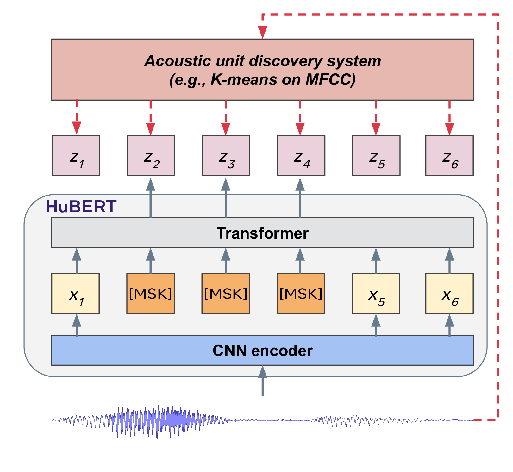

# Multilingual-PR

Implementation of the project ```Multi-lingual Phoneme Recognition using self-supervised methods on foreign languages```

> Authors: [Apavou Clément](https://github.com/clementapa) & [Belkada Younes](https://github.com/younesbelkada) & [Leo Tronchon](https://github.com/leot13) & [Arthur Zucker](https://github.com/ArthurZucker)


<p align="center">
  
</p>

This repository is powered by HuggingFace :hugs:,  Pytorch-Lightning and Weight & Biases.

## :bird: Introduction 

TODO (wait to do correctly in the report)

## :sparkles: Main features

+ Modularity between SOTA models in self-supervision for speech
+ Freedom to select any languages available on CommonVoice hosted at [HuggingFace](https://huggingface.co/datasets/common_voice). 
+ Nice visualization tool through wandb.

## :pencil2: Schema  

<p align="center">
  
</p>
<p align="center">
  <em> Diagram of the models used for the experiments. N=22 and h=1024 for HuBERT, and N=11 and h=768 for Wav2vec2 and WavLM. Made by us. </em>
</p>

## :books: Language that we can done with phonemes dictionaries available
Dutch (du), Spanish (es), French (fr), Italian (it), Kyrgyz (ky), Russian (ru), Sweedish
(sv), Turkish (tr), Tatar (tt) and Mandarin (zh). From https://github.com/facebookresearch/CPC_audio.

## :sound: Dataset

The project is based on [Mozilla CommonVoice dataset](https://commonvoice.mozilla.org/fr) available on [HuggingFace](https://huggingface.co/datasets/common_voice). 
When the script is launched, the program will automatically download the correct dataset and try to transform ground truth sentences to phonemes using [phonemizer](https://github.com/bootphon/phonemizer). You are free to chose any dataset available on HuggingFace with phonemes dictionaries previously cited to run your models. For our experiments we use:
```
it, nl, tr, ru, sv
```
Feel free to try any other languages and submit a Pull Request :electric_plug:.

## :paperclip: Pre-trained model studied

<p align="center">
  
  
  
</p>
<p align="center">
<em> Schema of Wav2vec2, HuBERT and WavLM. </em>
</p>

For our experiments, we used models hosted on Hugging Face library, that are pre-trained on 960 hours of **English** audio data from Librispeech dataset on 16kHz sampled speech audio. The following pre-trained models were used:
- Wav2vec2:  [facebook/wav2vec2-base-960h](https://huggingface.co/facebook/wav2vec2-base-960h)
- WavLM: [microsoft/wavlm-base](https://huggingface.co/microsoft/wavlm-base)
- HuBERT: [facebook/hubert-large-ls960-ft](https://huggingface.co/facebook/hubert-large-ls960-ft)
## :scroll: Data processing part

- [X] Explore the dataset on Mozilla common voices (https://commonvoice.mozilla.org/fr) available on HuggingFace? (https://huggingface.co/datasets/common_voice & https://huggingface.co/mozilla-foundation)
- [X] Script to transform sentence to phoneme (phonemizer : https://github.com/bootphon/phonemizer) : sentence_to_phoneme.py (language available : https://github.com/espeak-ng/espeak-ng/blob/master/docs/languages.md)
- [X] Tokenize labels to apply CTC
- [X] metric per
- [x] Wandb display using Hugging Face ? :
    - [x] Phoneme Error Rate (train and validation)
    - [x] Loss values (train and validation)
    - [x] some validation audio files with phoneme in labels and predictions ?
- [x] Get the features from a pre-trained model (Wav2Vec, HuBert and WavLM) on HuggingFace on the retrieved dataset
    - [x] Wav2Vec : https://huggingface.co/facebook/wav2vec2-base https://huggingface.co/docs/transformers/v4.16.2/en/model_doc/wav2vec2#overview
    - [x] HuBert : https://huggingface.co/docs/transformers/model_doc/hubert https://huggingface.co/docs/transformers/v4.16.2/en/model_doc/hubert#overview
    - [x] WavLM : https://huggingface.co/microsoft/wavlm-base https://huggingface.co/docs/transformers/v4.16.2/en/model_doc/wavlm#overview
- [X] Split the dataset into a trainval / test set. Make sure that the speakers do not occur both on the train set and test set -> **Already done in HF**

## :pencil: Modeling part

- [X] Implement CTC algorithm using PyTorch
- [X] Metric : implement the Phoneme Error Rate
- [x] Train the model on the built dataset and using pretrained features of different SSL method
- [ ] Train on 10 minutes, 1 hour and 10 hours of data
- [x] Benchmark for different languages

## :family: Language Family

<center>

| Language | Family |
|---|---|
| Italian :it: | *Romance* |
| Russian :ru: | *East Slavic* |
| Dutch 🇳🇱 | *West Germanic* |
| Swedish 🇸🇪 | *North Germanic* |
| Turkish :tr: | *Turkic* |

</center>

**English** is a part of the *West Germanic* family.\
Source: https://github.com/espeak-ng/espeak-ng/blob/master/docs/languages.md

## :chart_with_upwards_trend: Main results

dataset: Common Voice Corpus 6.1 : https://commonvoice.mozilla.org/fr/datasets 

Pretrained English models to other languages

### 🚀 Fine-tuning

| Language | Training data (in hours) | Model | PER validation | PER test | Run |
|---|---|---|---|---|---|
| Italian | X | Wav2Vec2 | X | X | [](https://wandb.ai/asr-project/test-asr?workspace=user-clementapa) |
| Italian | X | Hubert | X | X | [](https://wandb.ai/asr-project/test-asr?workspace=user-clementapa) |
| Italian | X | WavLM | X | X | [](https://wandb.ai/asr-project/test-asr?workspace=user-clementapa) |
| Russian | X | Wav2Vec2 | X | X | [](https://wandb.ai/asr-project/test-asr?workspace=user-clementapa) |
| Russian | X | Hubert | X | X | [](https://wandb.ai/asr-project/test-asr?workspace=user-clementapa) |
| Russian | X | WavLM | X | X | [](https://wandb.ai/asr-project/test-asr?workspace=user-clementapa) |
| Dutch | X | Wav2Vec2 | X | X | [](https://wandb.ai/asr-project/test-asr?workspace=user-clementapa) |
| Dutch | X | Hubert | X | X | [](https://wandb.ai/asr-project/test-asr?workspace=user-clementapa) |
| Dutch | X | WavLM | X | X | [](https://wandb.ai/asr-project/test-asr?workspace=user-clementapa) |
| Sweedish | X | Wav2Vec2 | X | X | [](https://wandb.ai/asr-project/test-asr?workspace=user-clementapa) |
| Sweedish | X | Hubert | X | X |[](https://wandb.ai/asr-project/test-asr?workspace=user-clementapa) |
| Sweedish | X | WavLM | X | X |[](https://wandb.ai/asr-project/test-asr?workspace=user-clementapa) |
| Turkish | X | Wav2Vec2 | X | X | [](https://wandb.ai/asr-project/test-asr?workspace=user-clementapa) |
| Turkish | X | Hubert | X | X |[](https://wandb.ai/asr-project/test-asr?workspace=user-clementapa) |
| Turkish | X | WavLM | X | X |[](https://wandb.ai/asr-project/test-asr?workspace=user-clementapa) |

### 🧊 Frozen Features

| Language | Training data (in hours) | Language Family | Model    | PER validation | PER test | Runs |
|----------|--------------------------|-----------------|----------|----------------|----------|------|
| Italian :it:| 62.34                    | Romance         | Wav2Vec2 | 38.94          | 36.84    | [](https://wandb.ai/asr-project/test-asr/runs/1wkydddw?workspace=user-clementapa)      |
|          |                          |                 | Hubert   | 23.85          |  21.15   | [](https://wandb.ai/asr-project/test-asr/runs/2esx3e99?workspace=user-clementapa)      |
|          |                          |                 | WavLM    | 27.29          | 25.98    | [](https://wandb.ai/asr-project/test-asr/runs/2771pb3w?workspace=user-clementapa)      |
| Russian :ru:| 15.55                    | East Slavic     | Wav2Vec2 | 50.11          | 48.69    | [](https://wandb.ai/asr-project/test-asr/runs/tqxh9iho?workspace=user-clementapa)      |
|          |                          |                 | Hubert   | 38.36          | 36.18    | [](https://wandb.ai/asr-project/test-asr/runs/1vcphgy6?workspace=user-clementapa)      |
|          |                          |                 | WavLM    | 40.66          | 38.76    | [](https://wandb.ai/asr-project/test-asr/runs/3em0h48e?workspace=user-clementapa)      |
| Dutch 🇳🇱 | 12.78                    | West Germanic   | Wav2Vec2 | 40.15          | 39.23    | [](https://wandb.ai/asr-project/test-asr/runs/3qiea6qt?workspace=user-clementapa)      |
|          |                          |                 | Hubert   | 27.62          | 26.68    | [](https://wandb.ai/asr-project/test-asr/runs/13nprcb5?workspace=user-clementapa)      |
|          |                          |                 | WavLM    | 34.94          | 35.67    | [](https://wandb.ai/asr-project/test-asr/runs/204zyxrk?workspace=user-clementapa)      |
| Swedish 🇸🇪| 3.22                     | North Germanic  | Wav2Vec2 | 50.30          | 45.23    | [](https://wandb.ai/asr-project/test-asr/runs/2v7why5t?workspace=user-clementapa)      |
|          |                          |                 | Hubert   | 37.34          | 32.68    | [](https://wandb.ai/asr-project/test-asr/runs/mgt5ofzn?workspace=user-clementapa)      |
|          |                          |                 | WavLM    | 43.65          | 40.55    | [](https://wandb.ai/asr-project/test-asr/runs/qt9ymhm1?workspace=user-clementapa)      |
| Turkish :tr:| 2.52                     | Turkic          | Wav2Vec2 | 53.92          | 52.08    | [](https://wandb.ai/asr-project/test-asr/runs/1kyc217g?workspace=user-clementapa)      |
|          |                          |                 | Hubert   | 39.55          | 37.08    | [](https://wandb.ai/asr-project/test-asr/runs/9flufqqm?workspace=user-clementapa)      |
|          |                          |                 | WavLM    | 47.18          | 45.53    | [](https://wandb.ai/asr-project/test-asr/runs/x9gqzh3q?workspace=user-clementapa) 
| Average  | -                        | All             | Wav2Vec2 | 46.684         | 44.414   | -    |
|          |                          |                 | Hubert   | 33.344         | 30.754   | -    | 
|          |                          |                 | WavLM    | 38.744         | 37.298   | -    | 

### ⌚ Training data  

## :pushpin: Project structure

```
├── agents
|   ├── BaseTrainer.py       
|   
├── assets                      # database and vocab phonemes are put here
|
├── config
|   ├── hparams.py              # configuration file
|
├── Datasets
|   |
|   ├── datamodule.py           # datamodules PyTorch lightning for CommonVoice dataset
|          
├── models
|   ├── BaseModule.py           #  lightning module 
|   ├── models.py               # Wav2vec2 WavLM and Hubert using Hugging Face library
| 
├── utils                       # utils functions
|   ├── agent_utils.py
|   ├── callbacks.py
|   ├── dataset_utils.py
|   ├── logger.py
|   ├── metrics.py              
|   ├── per.py                  # torch metrics implementation of the phoneme error rate
|
├── hparams.py                   # configuration file
|
├── main.py                      # main script to launch for training of inference 
|
└── README.md
```

## ⚡ Powered by

 <p align="center">
    <a href="https://huggingface.co/">
    
    <a href="https://wandb.ai/site">
    
    <a href="https://pytorch-lightning.readthedocs.io/en/latest/">
    

</p>
